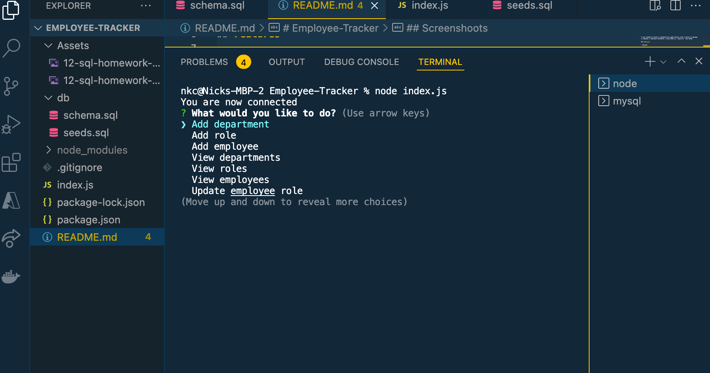
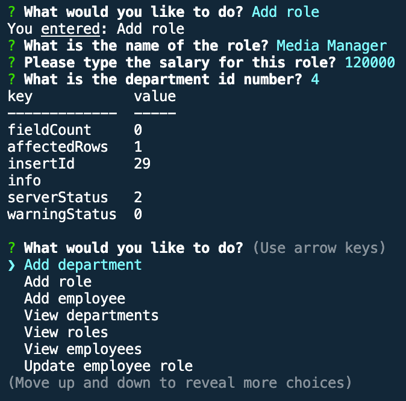
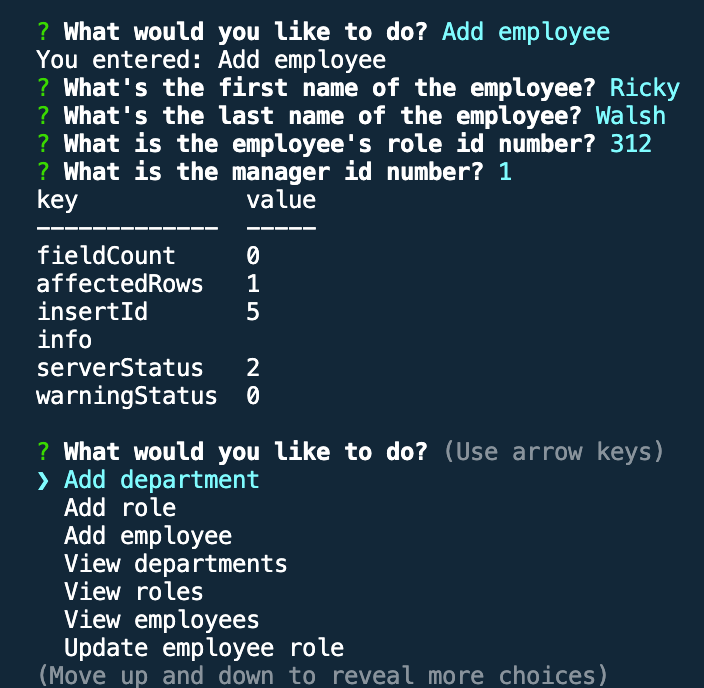
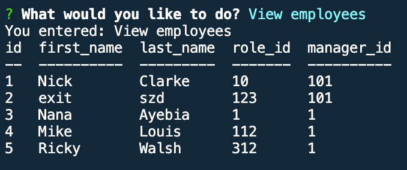

# Employee-Tracker

## Description

I was tasked to build a command-line application from scratch to manage a company's employee database, using Node.js, Inquirer, and MySQL.

## Features

- Mysql2
- npm inquirer
- Console.table

## Installation

For installation, clone this repository and use the npm i inquirer to install 'inquirer' and npm i mysql2 for mysql in the root folder. Then type node index.js to start the apllication.

## Screenshots

!

[view Roles](./Assets/images/viewroles.png)

# Video Walk through

